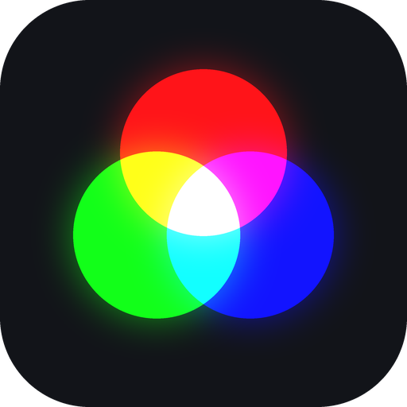

<div align="center">



# Lumea

**Desktop control for ELK-BLEDOM / MELK Bluetooth LED strips — drive multiple strips at once with a live color picker,
presets, and a system tray.**


</div>

# Quick start

```bash
pip install -r requirements.txt
python main.py
```

> If `pip install` fails on the newest Python, use a 3.11–3.13 interpreter (PySide6/Pillow wheels can lag).

## Install

| Windows                                                                                                                                         | macOS (Apple Silicon)                                                                     |
|-------------------------------------------------------------------------------------------------------------------------------------------------|-------------------------------------------------------------------------------------------|
| Download [`Lumea-windows.exe`](https://github.com/ugurcandede/lumea/releases/latest), then run it.<br>SmartScreen → **More info → Run anyway**. | `brew tap ugurcandede/lumea`<br>`brew install --cask lumea`<br>Clears Gatekeeper for you. |

## Prerequisites

- Python 3.11+
- A strip advertising as `ELK-BLE`, `MELK`, or `ELK-BULB`
- Bluetooth turned on

## Usage

1. **Scan** — lists nearby strips.
2. **Tick** the devices you want, then press **Connect Selected**. Double-click a row to set an **alias**.
3. **On / Off** and the **color picker** (live) — commands go to every checked-and-connected device at once.
4. **Presets** — the 5 swatches: left-click applies, right-click saves the current color.
5. **Disconnect All** drops every connection.

Closing the window keeps the app in the **system tray**. Checked devices, aliases, presets and the last color are saved
and restored on launch, and dropped links auto-reconnect.

## Features

- Control **multiple strips at once**
- Per-device **aliases**
- **Live color** picker with 5 savable **presets**
- **System tray** — runs in the background, icon reflects the current color
- Settings persistence and auto-reconnect

## Layout

```
main.py          entry point: QApplication + qasync event loop
ble.py           scan(); ElkBledom (one strip); DeviceManager (many strips, fan-out)
ui.py            LedController: device list, color, presets, system tray
colorpicker.py   embedded SV-square + hue-bar color picker
icon.py          app icon + dynamic tray icon
protocol.py      pure command encoders
```

---

<p align="center">
   <a href="https://github.com/ugurcandede">
    
  </a>
</p>

<p align="center">
  <sub>Not affiliated with the makers of ELK-BLEDOM / MELK devices.</sub>
</p>
